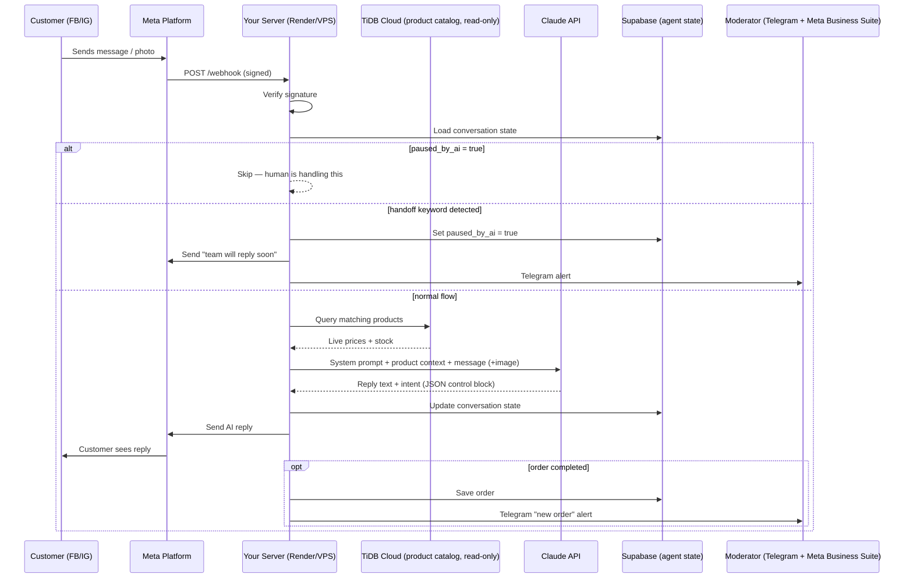

# Big Bazar AI Agent — Self-Hosted Stack

A fully self-owned alternative to ManyChat/Make.com. You run this on your own
server (free/cheap tier), it talks directly to Meta's Webhook API and the
Claude API, and reads your existing TiDB product catalog read-only.

## 1. System Architecture



**Why this shape:**
- **TiDB stays read-only.** Your live storefront database is never written to by the agent — zero risk of corruption.
- **Supabase (separate project) owns agent state.** Conversation progress and orders live here, fully isolated.
- **Claude returns structured intent**, not just text — the server's state machine (not the AI) decides what happens next. This makes the system debuggable and prevents the AI from "freelancing" through your order funnel.
- **Handoff check happens before the AI is even called** — instant, deterministic, no AI latency or judgment call needed for the most urgent case.

## 2. Project Structure

```
src/
  app.js                    — Express entry point
  routes/
    webhook.js               — Meta webhook verify + receive
    admin.js                 — Moderator pause/resume API
  services/
    messageHandler.js        — The state machine (core logic)
    productSearch.js         — Wraps TiDB product queries
    supabase.js               — Agent state CRUD
    anthropic.js               — Claude API call + response parsing
    messenger.js                — FB Send API wrapper
    orderService.js              — Order persistence
    notifier.js                   — Telegram moderator alerts
  utils/
    nlp.js                         — Handoff keyword + phone extraction
    prompts.js                      — Dynamic system prompt builder
  middleware/
    verifySignature.js               — Meta webhook signature check
    errorHandler.js, requestLogger.js
  db/
    tidb.js                            — TiDB connection + queries
sql/
  schema.sql                           — Supabase tables (conversations, orders)
.env.example
```

## 3. Setup — Step by Step

### A. Meta App & Page setup
1. Go to [developers.facebook.com](https://developers.facebook.com) → Create App → "Business" type.
2. Add the **Messenger** product. Generate a **Page Access Token** for your Big Bazar page.
3. Copy your **App Secret** from App Settings → Basic.
4. You'll set the webhook URL in step D (after deploying).

### B. TiDB Cloud — get read credentials
1. In TiDB Cloud dashboard, open your cluster → **Connect**.
2. Copy: Host, Port (4000), Username, Password, Database name.
3. *(Optional but recommended)* Create a read-only MySQL user instead of using your main credentials:
   ```sql
   CREATE USER 'agent_readonly'@'%' IDENTIFIED BY 'strong_password_here';
   GRANT SELECT ON bigbazar.products TO 'agent_readonly'@'%';
   ```

### C. Supabase — agent state project
1. Create a **new, separate** free project at [supabase.com](https://supabase.com) (don't reuse the storefront's — if it has one; yours uses TiDB, so this is fresh).
2. Open SQL Editor → paste and run `sql/schema.sql`.
3. Copy your Project URL and **service_role** key (Settings → API).

### D. Telegram bot for moderator alerts
1. Message **@BotFather** on Telegram → `/newbot` → follow prompts → copy the token.
2. Message your new bot once (anything).
3. Visit `https://api.telegram.org/bot<TOKEN>/getUpdates` → find your `chat.id` in the response.

### E. Local setup
```bash
cp .env.example .env
# fill in all values from steps A-D
npm install
npm run dev
```

### F. Confirm your TiDB schema matches the code
Run in TiDB Cloud SQL console:
```sql
SHOW CREATE TABLE products;
```
Compare column names against the `COLUMNS` map at the top of `src/db/tidb.js`. Edit that one block if your real columns differ — nothing else needs to change.

## 4. Deploy for Free/Cheap

**Render.com (recommended — free tier sleeps after inactivity, $7/mo for always-on):**
1. Push this code to a GitHub repo.
2. Render → New → Web Service → connect repo.
3. Build command: `npm install` · Start command: `npm start`.
4. Add all `.env` values under Environment.
5. Deploy → copy your `https://your-app.onrender.com` URL.

### Connect the webhook
1. Meta App Dashboard → Messenger → Settings → Webhooks → Add Callback URL:
   `https://your-app.onrender.com/webhook`
2. Verify Token: same value as `META_VERIFY_TOKEN` in your `.env`.
3. Subscribe to: `messages`, `messaging_postbacks`.
4. Subscribe your Page to the app.

## 5. Testing checklist before going live

- [ ] Send "price koto" with a product name → confirm correct live price from TiDB returns
- [ ] Send a product photo → confirm Claude identifies it and matches catalog
- [ ] Complete a full order flow (name → address → phone) → confirm row appears in Supabase `orders` table and Telegram alert fires
- [ ] Type "manager chai" → confirm bot pauses, Telegram alert fires, `paused_by_ai = true` in Supabase
- [ ] While paused, send another message → confirm bot stays silent
- [ ] Call `POST /admin/conversations/:senderId/resume` with your `ADMIN_SECRET` header → confirm bot resumes

## 6. Known gaps to close before production

- `productSearch.js` uses simple `LIKE` matching — fine for a few hundred SKUs, but consider TiDB full-text search or embeddings if your catalog grows large.
- No retry/backoff on Claude or FB API calls — add for production resilience.
- Admin API has a single shared secret — fine for one moderator, upgrade to per-user auth if your team grows.
- Image-to-product matching relies entirely on Claude's vision description plus a text `LIKE` search — works well for distinct items (color/pattern), less precise for near-identical SKUs. A vector-embedding column on `products` (TiDB supports vector search) would meaningfully improve this later.
