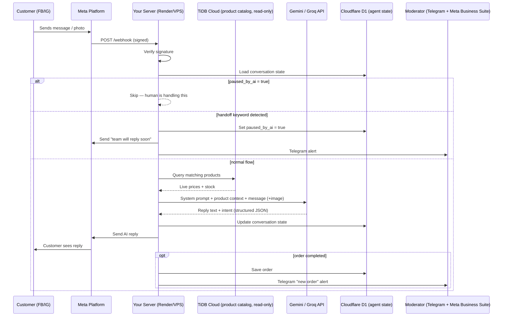

# Big Bazar AI Agent — Self-Hosted Stack

A fully self-owned alternative to ManyChat/Make.com. You run this on your own
server (free/cheap tier), it talks directly to Meta's Webhook API and the
Gemini/Groq AI API, and reads your existing TiDB product catalog read-only.

## 1. System Architecture


```mermaid
sequenceDiagram
    participant C as Customer (FB/IG)
    participant M as Meta Platform
    participant S as Your Server (Render/VPS)
    participant T as TiDB Cloud (product catalog, read-only)
    participant A as Gemini / Groq API
    participant D as Cloudflare D1 (agent state)
    participant H as Moderator (Telegram + Meta Business Suite)

    C->>M: Sends message / photo
    M->>S: POST /webhook (signed)
    S->>S: Verify signature
    S->>D: Load conversation state
    alt paused_by_ai = true
        S-->>S: Skip — human is handling this
    else handoff keyword detected
        S->>D: Set paused_by_ai = true
        S->>M: Send "team will reply soon"
        S->>H: Telegram alert
    else normal flow
        S->>T: Query matching products
        T-->>S: Live prices + stock
        S->>A: System prompt + product context + message (+image)
        A-->>S: Reply text + intent (structured JSON)
        S->>D: Update conversation state
        S->>M: Send AI reply
        M->>C: Customer sees reply
        opt order completed
            S->>D: Save order
            S->>H: Telegram "new order" alert
        end
    end
```

**Why this shape:**
- **TiDB stays read-only.** Your live storefront database is never written to by the agent — zero risk of corruption.
- **Cloudflare D1 (separate, free SQLite database) owns agent state.** Conversation progress and orders live here, fully isolated.
- **Gemini/Groq returns structured JSON intent**, not just text — the server's state machine (not the AI) decides what happens next. This makes the system debuggable and prevents the AI from "freelancing" through your order funnel.
- **Handoff check happens before the AI is even called** — instant, deterministic, no AI latency or judgment call needed for the most urgent case.

## 2. Project Structure

```
src/
  app.js                    — Express entry point
  routes/
    webhook.js               — Meta webhook verify + receive
    admin.js                 — Moderator pause/resume API
  services/
    messageHandler.js        — The state machine (core logic)
    productSearch.js         — Wraps TiDB product queries
    ai.js                    — AI provider wrapper (routes to Gemini or Groq)
    gemini.js                — Gemini API integration (vision + structured JSON)
    groq.js                  — Groq API integration (text-only, JSON mode)
    d1.js                    — Cloudflare D1 agent state CRUD
    messenger.js             — FB Send API wrapper
    orderService.js          — Order persistence (via D1)
    notifier.js              — Telegram moderator alerts
  utils/
    nlp.js                   — Handoff keyword + phone extraction
    prompts.js               — Dynamic system prompt builder
  middleware/
    verifySignature.js       — Meta webhook signature check
    errorHandler.js, requestLogger.js
  db/
    tidb.js                  — TiDB connection + queries (READ ONLY)
sql/
  schema-d1.sql              — Cloudflare D1 tables (conversations, orders)
  schema-products.sql        — Reconstructed TiDB products catalog schema
.env.example
```

## 3. Setup — Step by Step

### A. Meta App & Page setup
1. Go to [developers.facebook.com](https://developers.facebook.com) → Create App → "Business" type.
2. Add the **Messenger** product. Generate a **Page Access Token** for your Big Bazar page.
3. Copy your **App Secret** from App Settings → Basic.
4. You'll set the webhook URL in step E (after deploying).

### B. TiDB Cloud — get read credentials
1. In TiDB Cloud dashboard, open your cluster → **Connect**.
2. Copy: Host, Port (4000), Username, Password, Database name.
3. *(Optional but recommended)* Create a read-only MySQL user instead of using your main credentials:
   ```sql
   CREATE USER 'agent_readonly'@'%' IDENTIFIED BY 'strong_password_here';
   GRANT SELECT ON bigbazar.products TO 'agent_readonly'@'%';
   ```

### C. Gemini API key (recommended — required for vision/photo identification)
1. Go to [Google AI Studio](https://aistudio.google.com/app/apikey) and create a free API key.
2. Set `GEMINI_API_KEY` and `AI_PROVIDER=gemini` in your `.env` file.
3. *(Optional)* Set `GEMINI_MODEL` to a specific model (default: `gemini-2.5-flash`).

> **Note:** Groq can be used as a fallback for text-only conversations (`AI_PROVIDER=groq`), but it has **zero vision capability** — product photo identification will not work.

### D. Cloudflare D1 — agent state database
1. Create a free Cloudflare account at [dash.cloudflare.com](https://dash.cloudflare.com).
2. Go to Workers & Pages → D1 → Create database.
3. Copy your Account ID, Database ID, and create an API token with D1 read/write permissions.
4. Run `node setup-d1.js` to create the schema, or paste `sql/schema-d1.sql` in the D1 SQL console.

### E. Telegram bot for moderator alerts
1. Message **@BotFather** on Telegram → `/newbot` → follow prompts → copy the token.
2. Message your new bot once (anything).
3. Visit `https://api.telegram.org/bot<TOKEN>/getUpdates` → find your `chat.id` in the response.

### F. Local setup
```bash
cp .env.example .env
# fill in all values from steps A-E
npm install
npm run dev
```

### G. Confirm your TiDB schema matches the code
Run in TiDB Cloud SQL console:
```sql
SHOW CREATE TABLE products;
```
Compare column names against the `COLUMNS` map at the top of `src/db/tidb.js`. Edit that one block if your real columns differ — nothing else needs to change.

## 4. Deploy for Free/Cheap

**Render.com (recommended — free tier sleeps after inactivity, $7/mo for always-on):**
1. Push this code to a GitHub repo.
2. Render → New → Web Service → connect repo.
3. Build command: `npm install` · Start command: `npm start`.
4. Add all `.env` values under Environment.
5. Deploy → copy your `https://your-app.onrender.com` URL.

### Connect the webhook
1. Meta App Dashboard → Messenger → Settings → Webhooks → Add Callback URL:
   `https://your-app.onrender.com/webhook`
2. Verify Token: same value as `META_VERIFY_TOKEN` in your `.env`.
3. Subscribe to: `messages`, `messaging_postbacks`.
4. Subscribe your Page to the app.

## 5. Testing checklist before going live

- [ ] Send "price koto" with a product name → confirm correct live price from TiDB returns
- [ ] Send a product photo → confirm Gemini identifies it and matches catalog (check logs for `🎯 [Gemini Vision]`)
- [ ] Complete a full order flow (name → address → phone) → confirm row appears in D1 `orders` table and Telegram alert fires
- [ ] Type "manager chai" → confirm bot pauses, Telegram alert fires, `paused_by_ai = 1` in D1
- [ ] While paused, send another message → confirm bot stays silent
- [ ] Call `POST /admin/conversations/:senderId/resume` with your `ADMIN_SECRET` header → confirm bot resumes

## 6. Known gaps to close before production

- `productSearch.js` uses simple `LIKE` matching — fine for a few hundred SKUs, but consider TiDB full-text search or embeddings if your catalog grows large.
- No retry/backoff on Gemini/Groq or FB API calls — add for production resilience.
- Admin API has a single shared secret — fine for one moderator, upgrade to per-user auth if your team grows.
- Image-to-product matching relies on Gemini's vision description plus a text `LIKE` search — works well for distinct items (color/pattern), less precise for near-identical SKUs. A vector-embedding column on `products` (TiDB supports vector search) would meaningfully improve this later.
